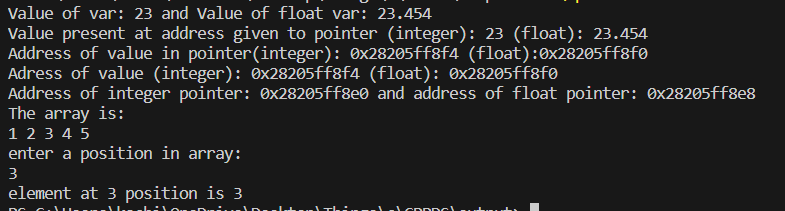

# Pointers
A code explaining the basics of Pointers in cpp programming language
## Theory
Pointers point to a variables address. They enable programs to simulate call-by-reference as well as to create and manipulate dynamic data structures. Iterating over elements in arrays or other data structures is one of the main use of pointers. The syntax for pointer are:</br>
```data_type *variable_name;``` </br>
For example:</br>```int *keshav;```</br>
### How to use a pointer?
- Define a pointer variable
- Assigning the address of a variable to a pointer using the unary operator (&) which returns the address of that variable.
- Accessing the value stored in the address using unary operator (*) which returns the value of the variable located at the address specified.
## Outcome of the code
1. TO make basic code with the understanding of the pointer
2. To use pointers to print all the elements of the array
3. To use pointers to print specific vales defined at specific indices in an array
## Algorithm
1. Start
2. Declare and initialize variables
3. Declare and initialize pointers to those variables
4. Print the variables and their addresses and the pointer and their addresses
5. Declare and initialize an array and initialize a pointer with the first index of the array
6. Using a for loop run the loop N number of times and print thr value adressed to the pointer and increment the pointer every time the loop runs
7. Ask the user to input a number (an Index of the array) and print that value in that array by adding the number inputted by the user
## Explaination
When we increment a pointer, we increase the pointer by the size of the data type to which it points. ANd since an arrays data is in a contigious manner, if we increment the pointer, the index also gets incremented.
The diagrammtic schematic is:

## Output Screenshot

